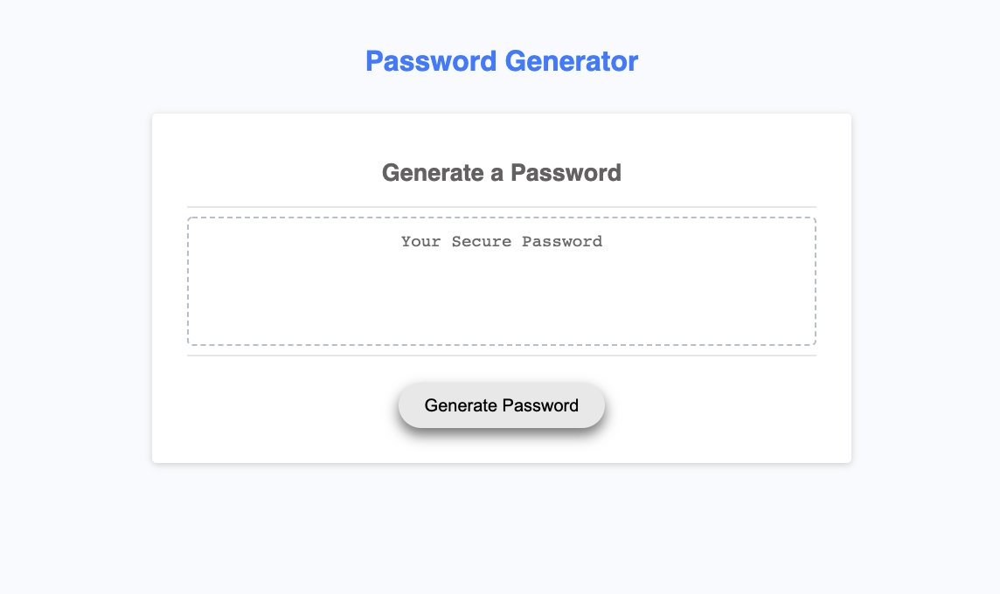

# Random Password Generator

## Introduction
This random password generator allows the user to select a list of characters to add into their randomized password. The user will go through a series of prompts starting with how many characters they would like to include in their password, this number must be between 8 and 128 characters. The user will then select if they would like to include lowercase characters, uppercase characters, numbers, or special characters to be included in their password. Once the user makes their choices through the selections their random password will then be generated. 

## Link to Random Password Generator
**Link to website:** https://cortlandfinch.github.io/super-secret/

## Website design
